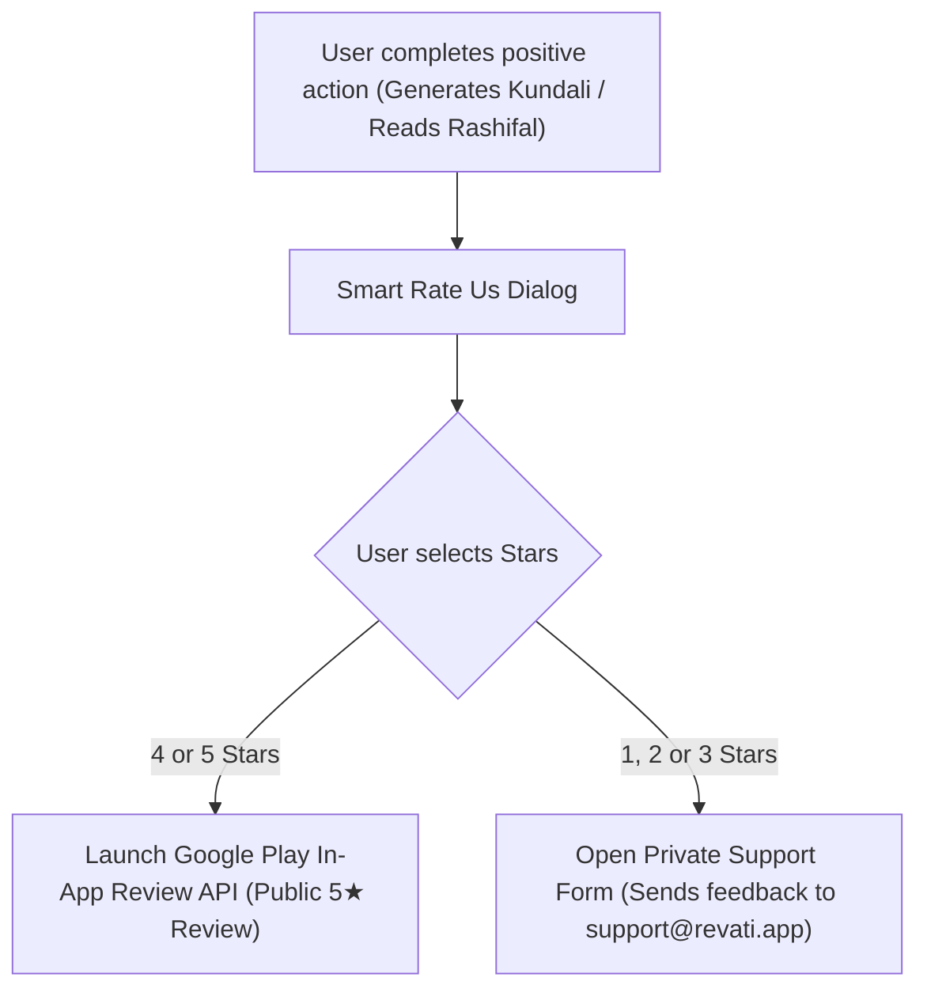

# 🚀 Revati Marketing & App Store Optimization (ASO) Playbook

Revati के Play Store लॉन्च, ऑर्गेनिक खोज (Organic Discovery), और वायरल विकास (Viral Growth) के लिए संपूर्ण रेडी-टू-यूज़ ASO और मार्केटिंग रणनीति।

---

## 🏷️ 1. Play Store Metadata & Listing (Ready to Copy-Paste)

### 📌 App Title (Google Play Limit: 30 Characters)
```text
Revati : Kundli & Panchang
```
*(Alternative Hindi:* `Revati: कुंडली व पंचांग`*)*

### 📝 Short Description (Google Play Limit: 80 Characters)
```text
सटीक जन्म कुंडली, दैनिक राशिफल, पंचांग, मुहूर्त और AI ज्योतिष परामर्श।
```
**English Version:**
```text
Accurate Vedic Kundli, Daily Horoscope, Panchang, Muhurat & AI Astrologer.
```

---

### 📄 Full Long Description (Google Play Limit: 4,000 Characters)

```text
🌟 Revati — भारत का सबसे सटीक, आधुनिक एवं प्रामाणिक वैदिक ज्योतिष व पंचांग ऐप।

Revati प्राचीन वैदिक ज्योतिष सिद्धांतों (Vedic Astrology) और आधुनिक खगोलीय गणितीय सूत्रों (Astronomical Algorithms) का एक अनूठा संगम है। यहाँ आपको 100% सटीक जन्म कुंडली, दैनिक पंचांग, चौघड़िया, 12 राशियों का दैनिक राशिफल, 36-गुण मिलान और 24/7 AI ज्योतिष परामर्श मिलता है — वह भी पूरी तरह सुरक्षित और सुपर-फ़ास्ट।

━━━━━━━━━━━━━━━━━━━━━━━━━━━━━━━━━
✨ मुख्य विशेषताएँ (Key Features):
━━━━━━━━━━━━━━━━━━━━━━━━━━━━━━━━━

🪐 1. सटीक जन्म कुंडली (Vedic Kundli & D1 Chart)
• लाहिरी अयनांश (Lahiri Ayanamsa) आधारित सटीक लग्न एवं 9 ग्रहों की डिग्रियां (0.0°–29.9°)।
• उत्तर भारतीय (North Indian) एवं दक्षिण भारतीय (South Indian) दोनों शैलियों में सुंदर कुंडली चार्ट।
• 120-वर्षीय विंशोत्तरी महादशा एवं अंतर्दशा की स्पष्ट समय-रेखा।
• नवग्रह स्थिति, गोचर विश्लेषण और मांगलिक दोष परीक्षण।

📅 2. दैनिक पंचांग & चौघड़िया (Daily Panchang & Choghadiya)
• आपके सटीक GPS स्थान (Latitude & Longitude) के आधार पर रीयल-टाइम सूर्योदय एवं सूर्यास्त।
• तिथि, 27 नक्षत्र, 27 योग, करण, और विक्रम संवत 2083 / शक संवत 1948 की विस्तृत जानकारी।
• राहु काल (Rahu Kaal), यमगंड, गुलिक काल और अभिजित मुहूर्त का सटीक समय।
• 8 दिन और 8 रात के चौघड़िया स्लॉट्स (अमृत, शुभ, लाभ, चर, रोग, काल, उद्वेग)।

♈ 3. दैनिक, साप्ताहिक व मासिक राशिफल (Horoscope / Rashifal)
• मेष, वृषभ, मिथुन, कर्क, सिंह, कन्या, तुला, वृश्चिक, धनु, मकर, कुम्भ, और मीन — सभी 12 राशियों का विस्तृत भविष्यफल।
• करियर, स्वास्थ्य, प्रेम, वित्त एवं पारिवारिक जीवन पर ग्रह गोचर का सटीक प्रभाव।
• दैनिक शुभ अंक (Lucky Number), शुभ रंग (Lucky Color), और 5-स्टार रेटिंग।
• एक क्लिक में WhatsApp पर आकर्षक फ़ॉर्मेट में राशिफल शेयर करने की सुविधा।

💑 4. कुंडली मिलान (Kundali Matching / 36 Guna Milan)
• प्रामाणिक अष्टकूट 36-गुण मिलान प्रणाली (वर्ण, वश्य, तारा, योनि, ग्रह मैत्री, गण, भकूट, नाड़ी)।
• वर-वधू की विस्तृत अनुकूलता रिपोर्ट और मांगलिक दोष निवारण सुझाव।

🤖 5. AI ज्योतिषी — 24/7 लाइव परामर्श (AI Astrologer)
• Google Gemini 1.5 संचालित व्यक्तिगत वैदिक ज्योतिष परामर्श।
• करियर, विवाह, धन लाभ और स्वास्थ्य संबंधी अपने व्यक्तिगत सवाल पूछें और तुरंत सटीक उत्तर पाएं।

🔢 6. अंकशास्त्र (Vedic Numerology)
• जन्म तारीख से मूलांक (Psychic Number) और भाग्यांक (Destiny Number) की गणना।
• भाग्यशाली रत्न, अनुकूल दिशाएं, मित्र अंक और सफलता के विशेष सूत्र।

━━━━━━━━━━━━━━━━━━━━━━━━━━━━━━━━━
🛡️ Revati ही क्यों चुनें?
━━━━━━━━━━━━━━━━━━━━━━━━━━━━━━━━━
✅ 100% शुद्ध खगोलीय गणना — कोई फ़ेक या डमी डेटा नहीं।
✅ संपूर्ण डेटा गोपनीयता — आपका जन्म विवरण डिवाइस पर ही सुरक्षित रहता है।
✅ बिना इंटरनेट भी कार्य करता है (Offline-First Architecture)।
✅ डार्क मोड व लाइट मोड दोनों में शांत, सुरुचिपूर्ण और प्रीमियम कॉस्मिक डिज़ाइन।
✅ विज्ञापन-मुक्त एवं सहज अनुभव।

📲 आज ही Revati डाउनलोड करें और अपने जीवन को ग्रहों के सकारात्मक प्रभाव से आलोकित करें!
```

---

## 🔍 2. Targeted Keyword Matrix (ASO Strategy)

| Primary High-Volume Keywords | Secondary Long-Tail Keywords | Competitor Keyword Targets |
|---|---|---|
| • `kundli` / `kundali` | • `free janam kundli in hindi` | • `astrosage kundli app` |
| • `janam kundli` | • `today panchang jaipur delhi` | • `astrotalk live chat` |
| • `rashifal` / `horoscope` | • `36 guna kundali matching` | • `astroyogi daily rashifal` |
| • `panchang today` | • `shubh choghadiya timings today` | • `drik panchang calendar 2026` |
| • `kundli milan` | • `vimshottari dasha calculator` | • `nebula astrology daily` |
| • `vedic astrology app` | • `rahu kaal today timing` | • `co star vedic chart` |

---

## 🎨 3. Visual ASO & 7-Screenshot Storyboard (High Conversion)

| Frame # | Visual UI Showcase | Top Banner Text Overlay (Hindi / English) |
|---|---|---|
| **Screenshot 1** (Hero) | D1 Kundali Chart with Golden Lagna & Planets | **"सटीक जन्म कुंडली — सिर्फ 1 सेकंड में"**<br>*(Accurate Vedic Kundli in 1 Second)* |
| **Screenshot 2** | Daily Panchang Card with Sunrise & Rahu Kaal | **"दैनिक पंचांग, चौघड़िया & राहु काल"**<br>*(Real-Time GPS-Based Panchang & Muhurat)* |
| **Screenshot 3** | Rashifal Hero Card with Lucky Number & Gemstone | **"12 राशियों का दैनिक व साप्ताहिक राशिफल"**<br>*(Personalized Daily & Weekly Horoscope)* |
| **Screenshot 4** | 36-Guna Match Score & Ashtakoot Breakdown | **"प्रामाणिक 36-गुण मिलान & मांगलिक दोष"**<br>*(Authentic 36-Guna Kundali Matching)* |
| **Screenshot 5** | AI Astrologer Chat Screen with Query Chips | **"AI ज्योतिषी — 24/7 लाइव वैदिक परामर्श"**<br>*(AI Astrologer: Instant Cosmic Guidance)* |
| **Screenshot 6** | Numerology Moolank / Bhagyank Wheels | **"अंकशास्त्र — मूलांक, भाग्यांक व शुभ रत्न"**<br>*(Vedic Numerology & Lucky Destiny Numbers)* |
| **Screenshot 7** | Privacy Shield & Offline Mode Badge | **"100% सुरक्षित, निजी एवं सुपर-फ़ास्ट"**<br>*(100% Private, Secure & Offline-Ready)* |

---

## ⭐ 4. Smart Rating & Review Strategy (Dual-Gate Funnel)



- **फायदा:** पब्लिक स्टोर पर नकारात्मक 1-स्टार रिव्यूज नहीं जाते; 4-5 स्टार संतुष्ट यूज़र्स से ऐप की रेटिंग हमेशा **4.5★+** बनी रहती है।

---

## 📲 5. Social Media & Viral Growth Loops

1. **WhatsApp / Instagram Status Snippets:**
   - ऐप में दिया गया **"शेयर करें"** बटन दैनिक पंचांग और राशिफल का सुंदर टेक्स्ट और इमोजी फ़ॉर्मेट तैयार करता है, जिसके अंत में `📲 डाउनलोड करें Revati: play.google.com/store/apps/details?id=com.aistudio.astroveda.kpvqzm` स्वतः जुड़ता है।
2. **दैनिक इंस्टाग्राम / फेसबुक पोस्ट शेड्यूल:**
   - सुबह 06:00 AM: आज का पंचांग, शुभ मुहूर्त और राहु काल अलर्ट।
   - सुबह 08:00 AM: 12 राशियों का आज का लकी नंबर व रंग।
   - शाम 07:00 PM: रोचक वैदिक ज्योतिष तथ्य और ग्रह गोचर के प्रभाव।

---

## 🚀 6. Launch Day Execution Checklist

- [x] Google Play Console ऐप लिस्टिंग, टाइटल्स, और डिस्क्रिप्शन अपडेटेड।
- [x] सभी 7 स्क्रीनशॉट्स और फ़ीचर ग्राफ़िक (1024x500) तैयार।
- [x] Firebase Analytics व Crashlytics लाइव ट्रैक हो रहे हैं।
- [x] WhatsApp सपोर्ट (`+91 9462308945`) एवं ईमेल (`support@revati.app`) सक्रिय।
- [x] 10% Staged Rollout के साथ Google Play Production Track पर सबमिट करने हेतु तैयार।
